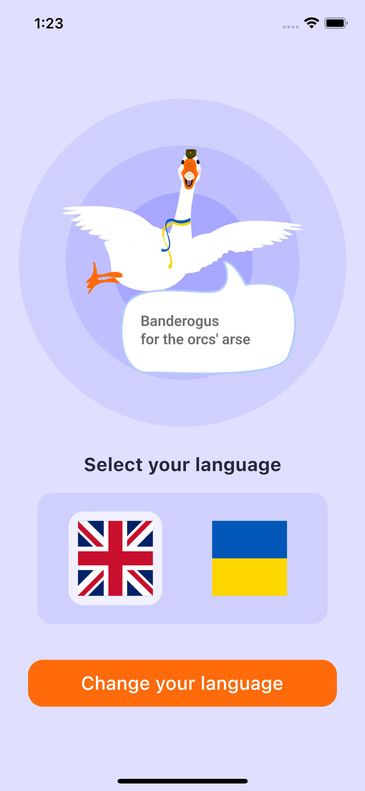
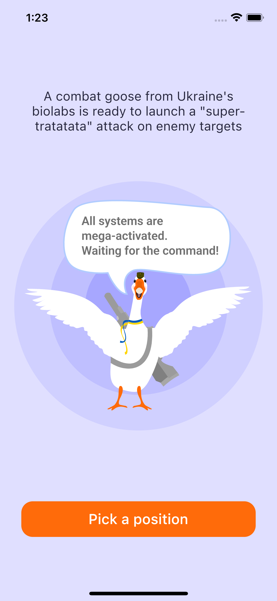
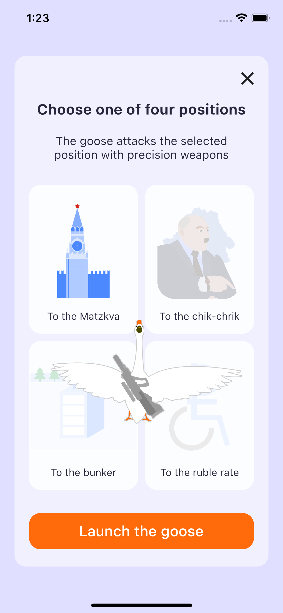

# flutter_gus_bandera

A new Flutter project. Design of a mobile application for launching a banderogus.

The design was taken from the [GoIT UI/UX marathon.](https://uxuidesign.m.goit.global/ua/start/) 
All rights to the design belong to the GoIT.

## Packages used

* flutter_svg v2.0.5
* provider v6.0.5
* country_icons v2.0.2
* flutter_localizations
* intl v0.17.0
* sqflite v2.2.8+2
* path_provider v2.0.15
* path v1.8.2

## App's screens

### EN version

### UA version

